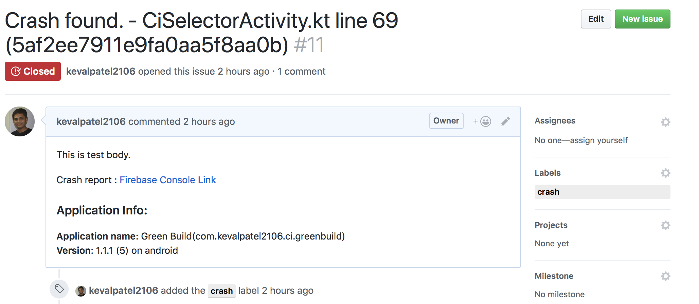

# GitHub Issue Creator

#### 🔥 Firebase cloud function to post a GitHub issue whenever new crash🐞 reported in firebase crashalytics.

Identify important conversion workflows in your app, so that when a new issue is reported in that workflow via Crashlytics, an GitHub issue is generated for you.. This will allow you to react quicker to crashes that impact important conversion workflows of your app.
 
_Note: Crashlytics is a crash reporter for Firebase. This assumes that you have Crashlytics in Firebase. [Learn more about Crashlytics](https://firebase.google.com/docs/crashlytics/)_

## Setting up the sample

- #### Create and setup the Firebase project:
	- Create a Firebase project using the [Firebase Developer Console](https://console.firebase.google.com).
	- Enable Billing on your Firebase the project by switching to the **Blaze** plan, this is currently needed to be able to perform HTTP requests to external services from a Cloud Function.
	- Include [Crashlytics in your project](https://firebase.google.com/docs/crashlytics/get-started).

- #### Configuring the sample
	- Clone or download this repo and open the root directory.
	- You must have the Firebase CLI installed. If you don't have it, install it with `npm install -g firebase-tools` and then configure it with `firebase login`.
	- Configure the CLI locally by using `firebase use --add` and select your project in the list.
	- Install `npm` dependencies in the functions directory locally, by running: `cd functions; npm install;`
  
- #### Setting up an Personal API tokens for GitHub
	- Set up an [Personal API tokens](https://blog.github.com/2013-05-16-personal-api-tokens/) in the account from which you want to post new issues. Note down the access token.
	- Config and set the environment variable for the access token and the GitHub repo (in which the new issues will be generated) by running this command: 
	`firebase functions:config:set github.base_url="https://api.github.com" github.token="<<Personal API tokens>>" issue.title="<<Title of the issue>>" issue.body="<<Text to start body of all issue with.>>" issue.lable="<<Issue lable>>" repo.owner="<<GitHub repo owner>>" repo.repo_name="<<>GitHub project name>"` 

## Deploy and test
- Deploy your project using `firebase deploy`
- Simulate a test crash. [Instructions](https://firebase.google.com/docs/crashlytics/force-a-crash)

## Sample issue:

## How to contribute?
* Check out contribution guidelines 👉[CONTRIBUTING.md](.github/CONTRIBUTING.md)

## Questions?🤔
Hit me on twitter 

## License
Copyright 2017 Keval Patel

Licensed under the Apache License, Version 2.0 (the "License"); you may not use this file except in compliance with the License. You may obtain a copy of the License at

http://www.apache.org/licenses/LICENSE-2.0

Unless required by applicable law or agreed to in writing, software distributed under the License is distributed on an "AS IS" BASIS, WITHOUT WARRANTIES OR CONDITIONS OF ANY KIND, either express or implied. See the License for the specific language governing permissions and limitations under the License.

